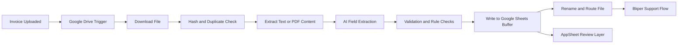

# n8n Invoice Automation System

An end-to-end invoice operations workflow built with **n8n**, **Google Drive**, **Google Sheets**, **Bkper**, and **AppSheet** to automate document intake, AI-assisted extraction, bookkeeping support, and human review.

This repository presents the project as a polished case study of a real business automation flow built in collaboration with **Hamza**.

## Live Showcase

- GitHub Pages case study: <https://abubakarshahid16.github.io/n8n-invoice-automation-system/>


## Project Summary

This system was designed to reduce the manual effort involved in processing incoming invoices. Instead of opening documents one by one, copying values into sheets, checking duplicates manually, renaming files, and updating bookkeeping views by hand, the workflow routes those tasks through a structured automation pipeline.

At a high level, the project:

- watches for newly uploaded invoice documents
- downloads and fingerprints files to detect duplicates
- extracts invoice fields through AI-assisted parsing
- validates results against business rules and reference data
- writes structured records into shared Google Sheets buffers
- routes and renames files into the correct storage paths
- supports bookkeeping follow-up through Bkper
- exposes review and status visibility through AppSheet

## Collaboration

This project was built **with Hamza** as a practical client-oriented automation system.

The collaboration focused on combining:

- workflow design in n8n
- AI-assisted document extraction
- bookkeeping support through Bkper
- operations tracking through Google Sheets
- review and exception handling through AppSheet

## Demo

- Loom walkthrough: <https://www.loom.com/share/4aa80837ba3e4d74999465464b80fe47>
- Repository demo video: [invoice-automation-demo.mp4](docs/demo/invoice-automation-demo.mp4)

### Demo Preview

[](https://www.loom.com/share/4aa80837ba3e4d74999465464b80fe47)

If GitHub preview is limited in your browser, use the bundled repository video directly:

- [Open the local repo demo video](docs/demo/invoice-automation-demo.mp4)

## Business Problem

Invoice handling often becomes messy when teams rely on disconnected tools and manual handoffs. Common problems include:

- repeated manual data entry
- duplicate invoices entering the pipeline
- inconsistent folder structure and naming
- weak visibility into processing status
- difficult coordination between operations and bookkeeping
- delayed review when extracted values need human confirmation

This project addresses those issues by turning invoice intake into a repeatable, traceable workflow.

## Tech Stack

- **n8n** for orchestration and workflow logic
- **Google Drive** for document intake and storage routing
- **Google Sheets** for reference data, master buffers, and tracking
- **Bkper** for bookkeeping-oriented follow-up
- **AppSheet** for lightweight review and status visibility
- **AI extraction / classification** inside the workflow for structured invoice parsing

## Architecture



## Workflow Breakdown

### 1. Intake Layer

New invoice files arrive in a Google Drive location monitored by n8n. This event triggers the workflow automatically, removing the need for a manual start step.

### 2. File Fingerprinting and Duplicate Control

The workflow downloads the incoming document and computes a hash so repeated uploads can be detected before duplicate records enter the system.

### 3. AI-Assisted Extraction

The document content is parsed to extract fields such as:

- invoice number
- supplier or vendor name
- invoice date
- amount
- company or category mapping
- confidence or review indicators

### 4. Validation and Business Rules

Extracted values are checked against reference data and workflow rules. This layer is important because real invoice processing needs safeguards, not just extraction.

### 5. Buffering and Tracking

Validated records are written into Google Sheets so the team has a structured master buffer for tracking, review, and downstream bookkeeping support.

### 6. Routing and Storage

The workflow renames or routes files into the appropriate storage path to keep documents consistently organized and easier to retrieve later.

### 7. Bookkeeping and Review

Bkper supports the accounting-facing side of the process, while AppSheet provides a human-in-the-loop view for status checks, review, and exceptions.

## Key Capabilities

- automated invoice ingestion from cloud storage
- duplicate prevention using file hashing and sheet lookups
- AI-assisted extraction of structured invoice fields
- rule-based validation before final logging
- operational master buffer creation in Google Sheets
- bookkeeping support integration through Bkper
- review and exception visibility through AppSheet
- cleaner routing, naming, and document storage behavior

## Screenshots

### Solution Context


### n8n Workflow

| Main Workflow | Extended Workflow |
| --- | --- |
|  |  |

### n8n Builder Interface


## Why This Repo Is Strong

This project demonstrates more than a simple automation script. It shows:

- multi-tool workflow orchestration
- applied AI inside a business process
- document automation with validation safeguards
- operations and bookkeeping coordination
- a realistic human-in-the-loop design
- practical experience building client-style automation

## Portfolio Value

This repository is especially relevant for:

- automation engineering roles
- AI operations roles
- no-code and low-code integration roles
- workflow design and business systems roles
- operations tooling and process improvement roles

## Repository Structure

```text
n8n-invoice-automation-system/
|-- README.md
`-- docs/
    |-- demo/
    |   `-- invoice-automation-demo.mp4
    |-- screenshots/
    |   |-- workflow-overview.png
    |   |-- bkper-flow.png
    |   |-- n8n-flow-1.jpg
    |   |-- n8n-flow-2.jpg
    |   `-- n8n-ui.jpg
    `-- CLIENT_CONFIDENTIALITY_NOTE.md
```

## Confidentiality Note

The repo uses workflow screenshots and a demo recording for portfolio presentation, but sensitive client-specific details should always be reviewed before broad public sharing. See [CLIENT_CONFIDENTIALITY_NOTE.md](docs/CLIENT_CONFIDENTIALITY_NOTE.md).

## Author

**Abubakar Shahid**  
GitHub: <https://github.com/abubakarshahid16>

## Collaboration Credit

Built in collaboration with **Hamza** as part of a real invoice automation workflow involving n8n orchestration, AI-supported extraction, bookkeeping support, and review operations.
